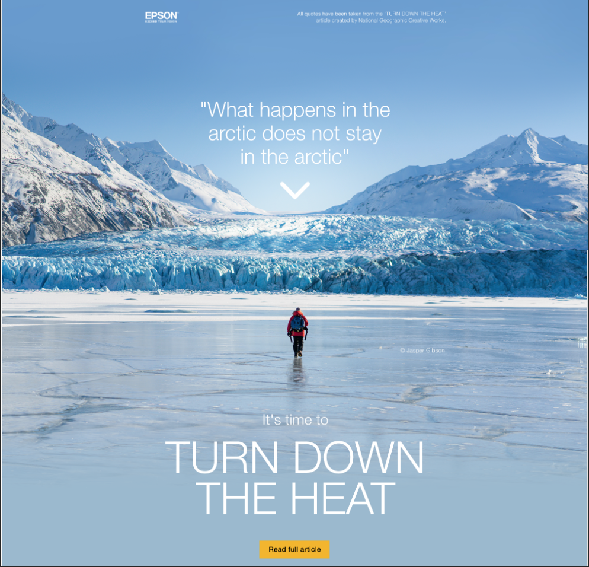
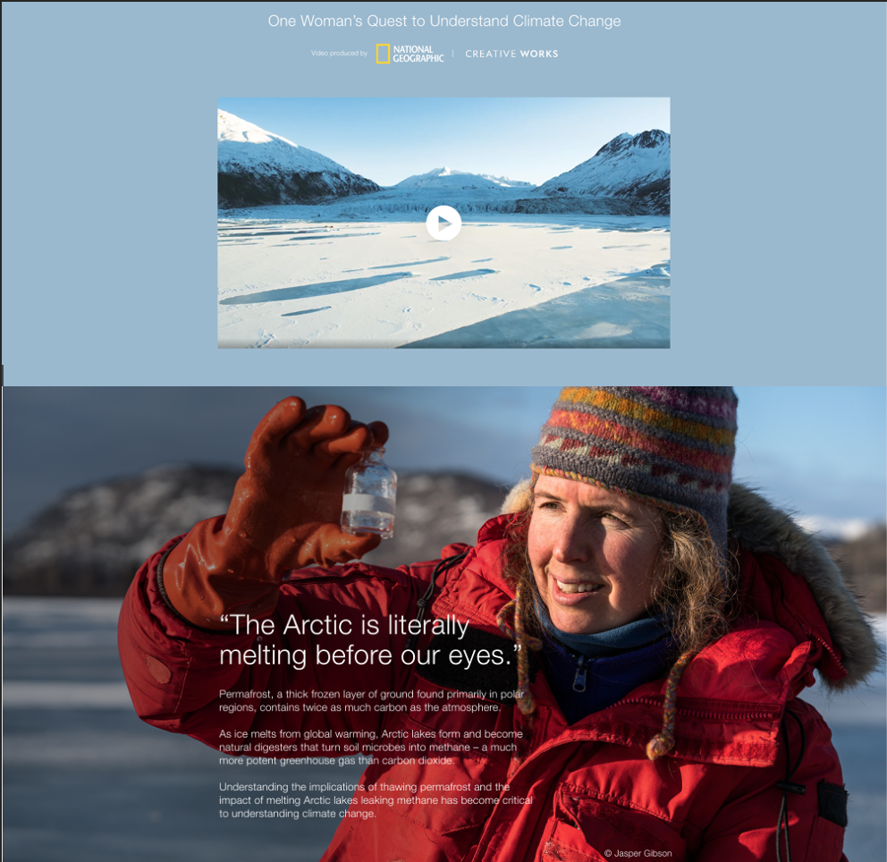
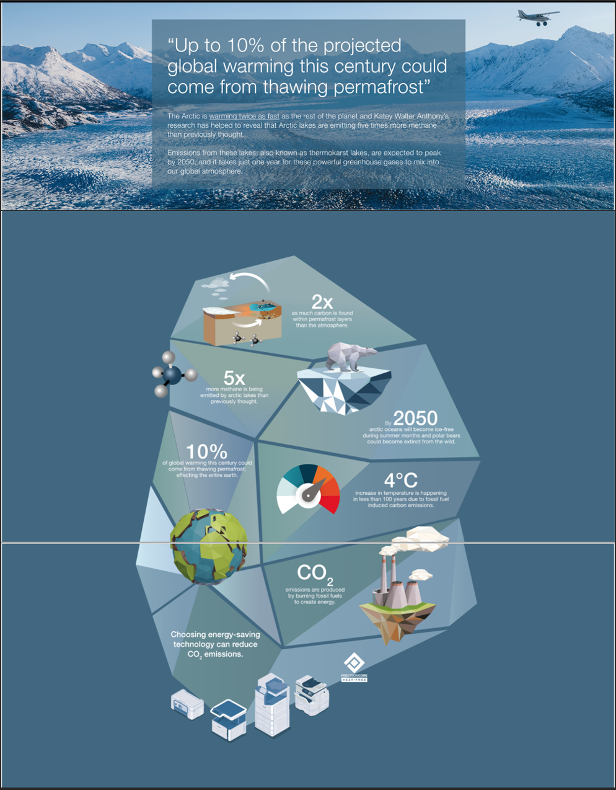
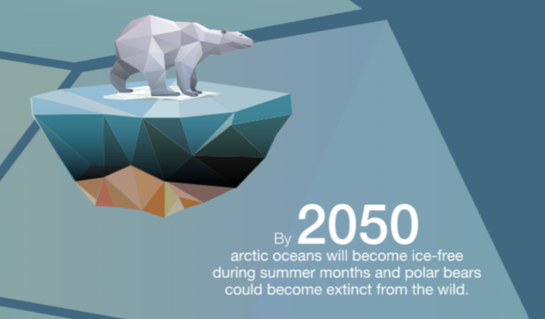
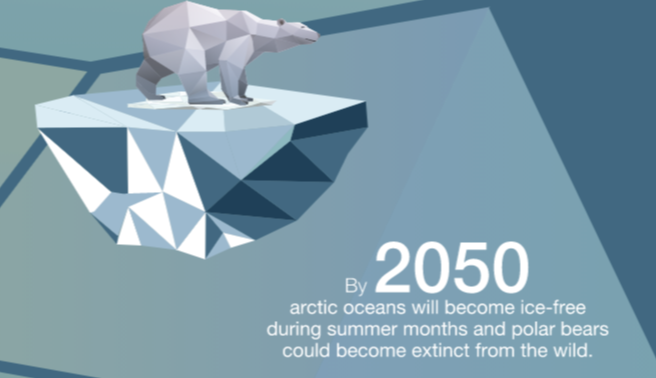
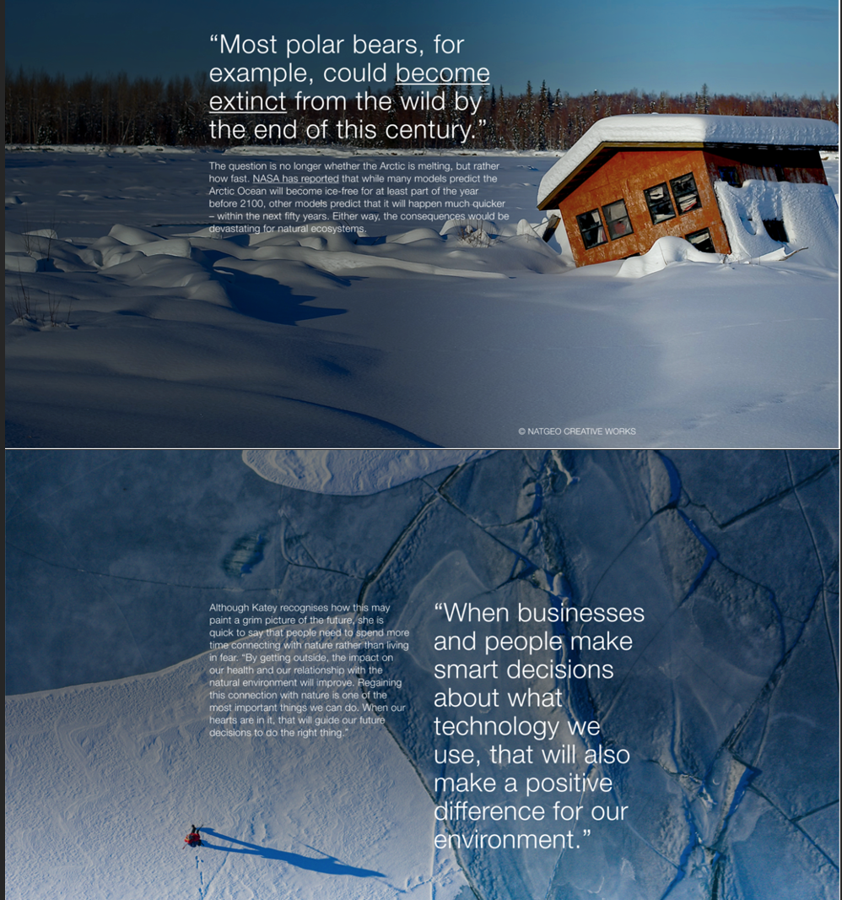
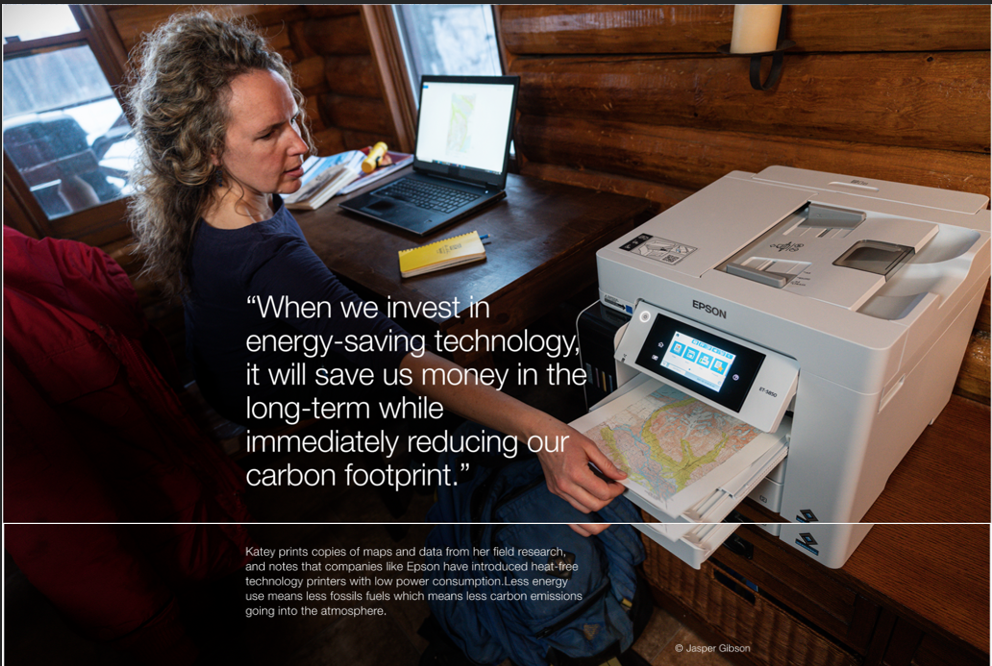
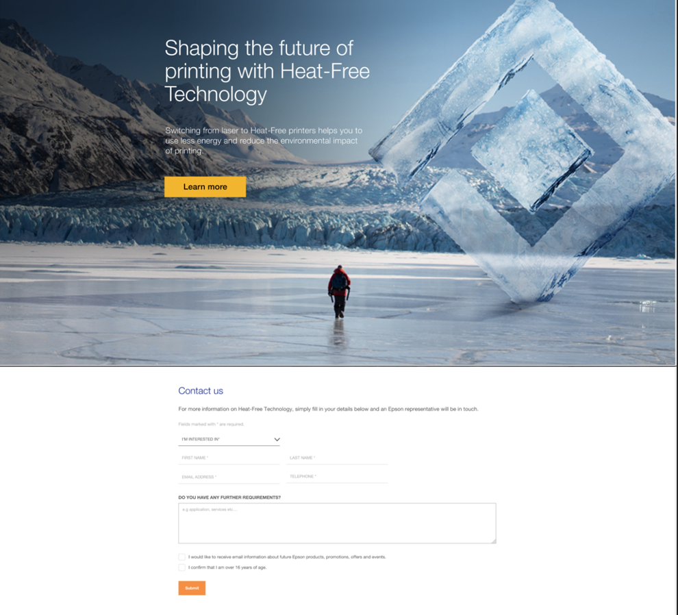
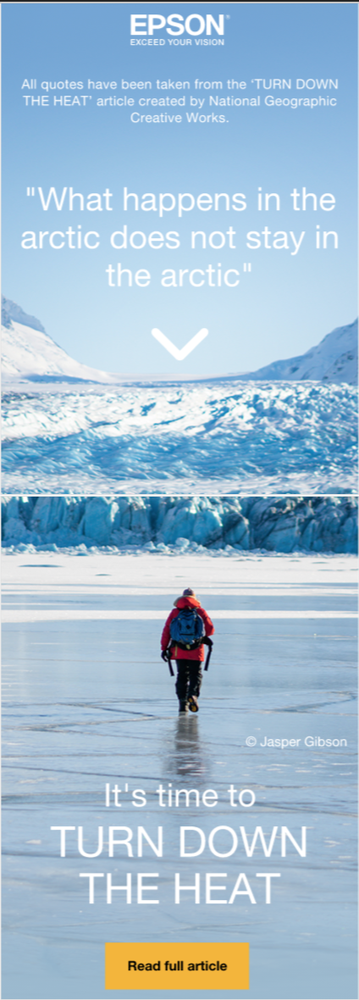

# epson-national-geographic

## Table of Contents
1.  [**Project Goals**](#project-goals)
    - [**Design choices**](#design-choices)

2. [**Features**](#features)

3. [**Technologies used**](#technologies-used)

4. [**Testing**](#testing)

5. [**Deployment**](#deployment)
    - [**How to run this project locally**](#how-to-run-this-project-locally)

6. [**Credits**](#credits)
    - [**Content**](#content)
    - [**Media**](#media)
    - [**Code**](#code)
    - [**Acknowledgements**](#acknowledgements)

### Project Goals

To create a Landing Page for the Client (Epson) regarding National Geographic, using HTML, Epson framework CSS and some Javascript. 

### Design Choices

XD Links can be found here:
<a href="https://xd.adobe.com/view/1cc3843d-588c-4fcf-8682-26c978b6830f-4990/" target="_blank">Mobile</a>
<a href="https://xd.adobe.com/view/deed9ba5-5aa2-4b46-9719-7e3c6329e715-8bbe/" target="_blank">Desktop</a>

### Screenshot of the page (This page is no longer live)
- Here are the screenshots for Desktop: 
    

    - Here is a screenshot of the hero section, I added Javascript on the white arrow to provide the user a smooth scroll to the next section.
     
     
    - I completed the Iceburg using CSS poitioning
     
    - Here is an example of the hover effect, done via CSS (swapping two images). 
     
     
    -Information 
     
     
     
    

- Here are the screenshots for mobile:
    

     
    

## Technologies and Code Used

- This project uses HTML, CSS and JavaScript programming languages.
- [Epson Framework CSS](https://www.epson.co.uk/)
    - The project uses **Epson Framework CSS** .
- [Visual Studio Code](https://code.visualstudio.com/) 
    - Developer used **Visual Studio Code** to create the Landing page. 
- [XD Link](https://helpx.adobe.com/xd/help/share-designs-prototypes.html)
    - All of my images used in the Landing page came from the XD Link

## Testing 

Testing information can be found in separate [testing.md](testing.md) file as well as [BrowserStack](https://www.browserstack.com). 

## Credits

### Content

- All text in this project was written by the developer.

#### Disclaimer

Thank you for taking your time to read this. 

Afra. 